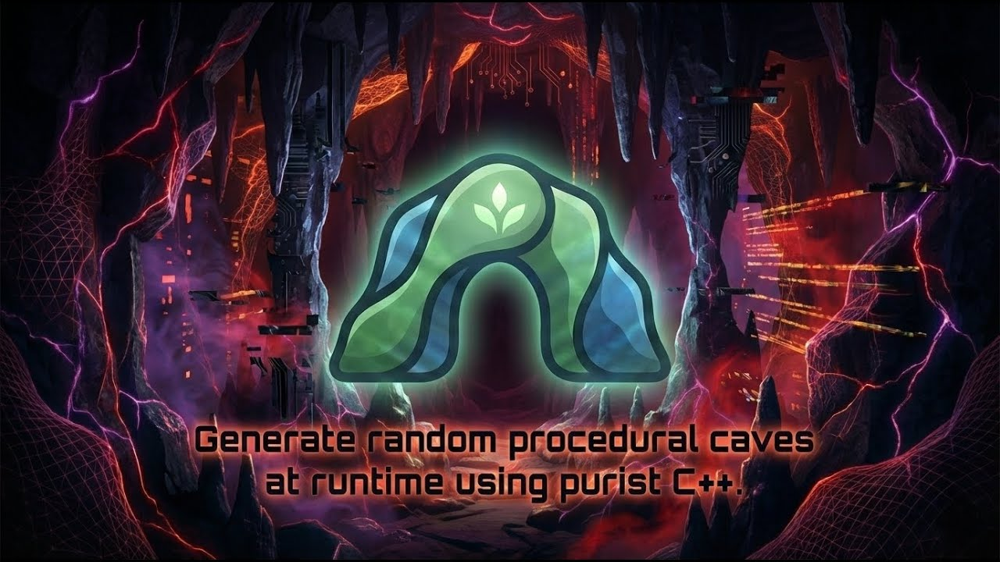
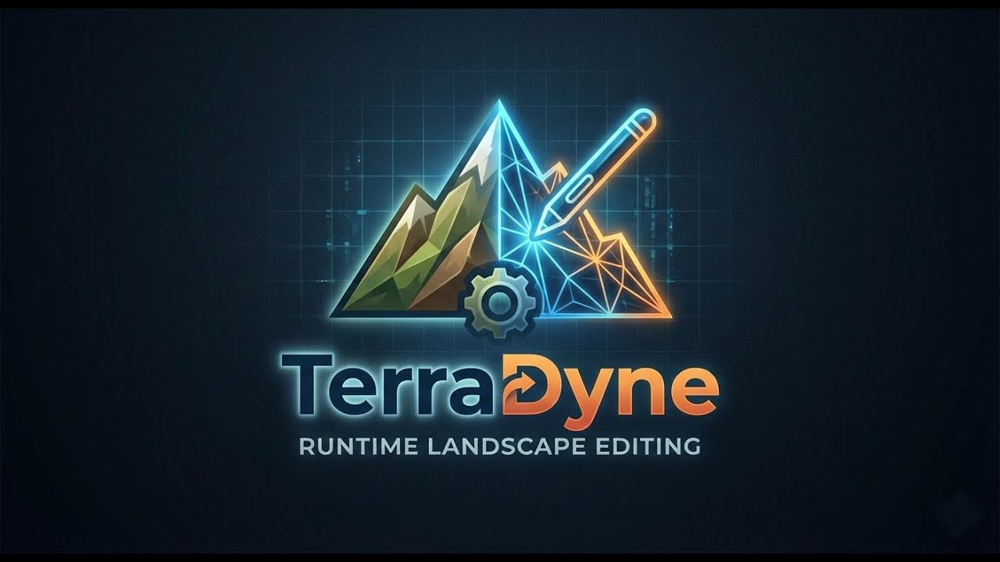
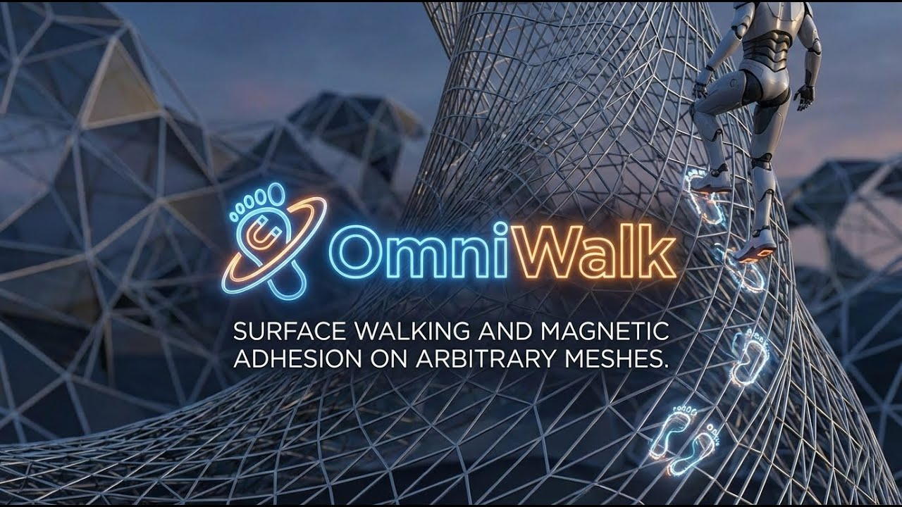
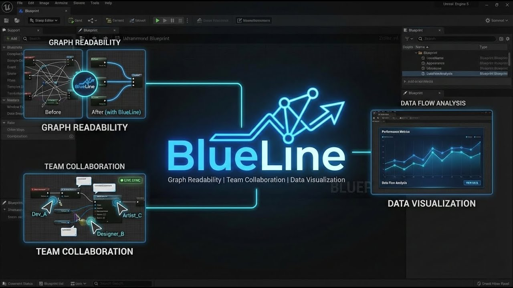
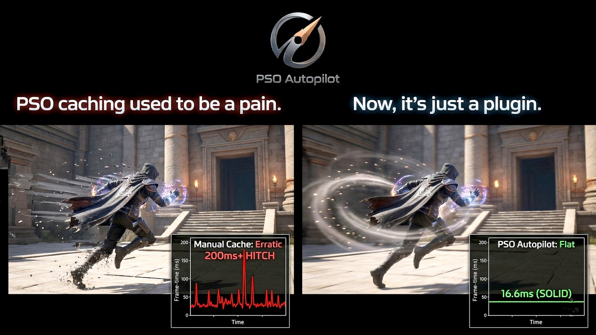
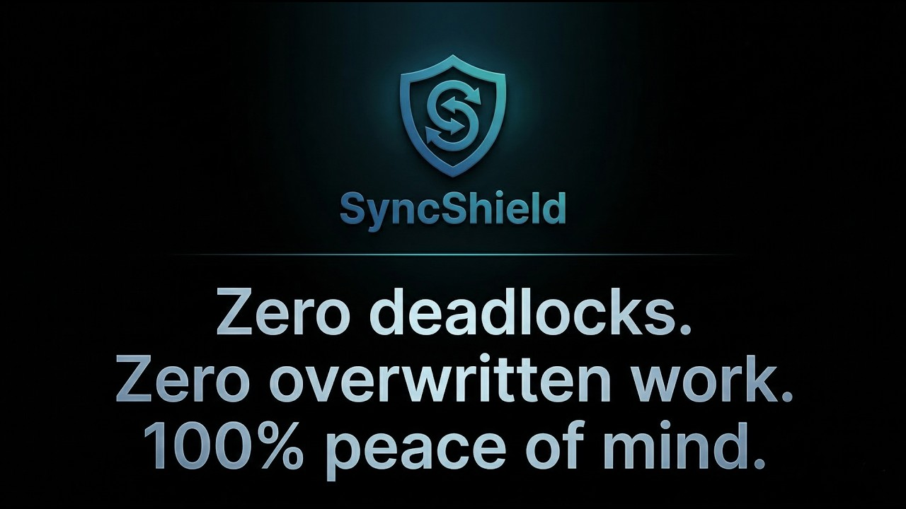

   # Andras Gregori (GregOrigin)
   **Unreal Engine, C++, C# Architect | Engine Level Systems | Procedural Generation**

   
   
   

   *I build high-performance, purist C++ systems for Unreal Engine 5, no blueprint spaghetti nor bloat, just ruthless
   optimization and native engine integration.*

   

   ---

   ### 🛡️ Engineering Philosophy
   I specialize in solving hard-tech problems within the Unreal Engine ecosystem that standard Blueprints cannot
   handle. My work focuses on **Runtime Procedural Generation**, **Custom Physics/Gravity Solvers**, and **Memory-Safe
   Asynchronous Tooling**.

   Some of the repositories below are the Open Source "Core" versions of my production-ready Pro Fab plugins. They
   are designed to act as highly optimized, lightweight alternatives for the UE developer community.

   ---

   ### 🚀 Featured Architectural Systems

   <table align="center">
     <tr>
       <td width="50%" align="center">
         
          
         <b>Instant Organic Caves (IOC)</b>
          
         <i>Lightweight, purist C++ engine for UE5 to generate procedural cave & rock structures at runtime.
   Zero-config Voxel architecture.</i>
          
         
       </td>
       <td width="50%" align="center">
         
          
         <b>TerraDyne</b>
          
         <i>Experimental, high-performance, native C++ landscape runtime plugin for UE 5.7. Unlocks real-time mesh
   deformation and persistence.</i>
          
         
       </td>
     </tr>
     <tr>
       <td width="50%" align="center">
         
          
         <b>OmniWalk</b>
          
         <i>Zero-Config Arbitrary Gravity & Surface Adhesion Framework. Native C++ "Magneboot" locomotion for
   Spider-walk and planetary gravity.</i>
          
         
       </td>
       <td width="50%" align="center">
         
          
         <b>BlueLine Core</b>
          
         <i>A comprehensive Blueprint UX/UI routing plugin. Features algorithmic wire-crossing minimization and
   semantic auto-tagging.</i>
          
         
       </td>
     </tr>
     <tr>
        <td width="50%" align="center">
         
          
         <b>PSO Autopilot</b>
          
         <i>Memory-safe chunking and time-sliced Game Thread yielding for automated Unreal Engine Shader Pipeline Cache
   collection.</i>
          
         
       </td>
       <td width="50%" align="center">
         
          
         <b>SyncShield / SafeSave</b>
          
         <i>Headless Git integration that intercepts dirty packages and provides strict file-locking protection to
   prevent team merge conflicts.</i>
          
         
       </td>
     </tr>
   </table>

   ---

   ### ⚙️ Technical Stack & Expertise

   *   **Languages:** `C++20`, `HLSL/GLSL`, `C#`, `Python`
   *   **Game Engine:** `Unreal Engine 5.4 - 5.7` (Source Builds, UBT, UAT, Plugin Architecture)
   *   **Core Systems:**
       *   Asynchronous Multithreading (TaskGraph, FMonitoredProcess)
       *   Dynamic/Procedural Mesh Generation (UDynamicMeshComponent, Voxels)
       *   Custom Locomotion & Physics Solvers (Bypassing standard CMC bloat)
       *   Editor Utilities, Slate UI, and Engine-Level Hooking
   *   **Graphics/Rendering:** Shader Pipeline Caching (PSO), Compute Shaders, Runtime Virtual Textures (RVT)

   ---

   ### 🤝 The "Pro" Ecosystem

   The repositories hosted here represent the foundation of my work. For studios, solo-devs, and enterprise teams
   looking for maximum polish, dedicated technical support, and expanded features (like genetic algorithms for graph
   sorting, or Nanite budgeting), the complete versions of these tools are available via the marketplace.

   **➡️ [View my current UE5 catalog on Fab](https://www.fab.com/sellers/GregOrigin)**

    

   

     
   

